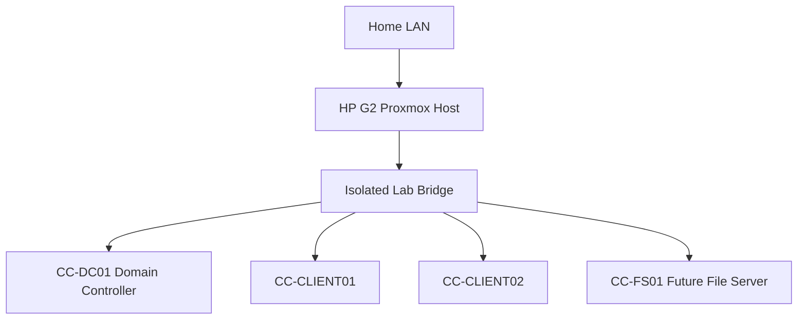

# Virtual Network Design

## Design objective

Keep the Active Directory lab isolated from the household network during the initial learning phase.

## Planned systems

## Addressing plan

Use documentation addresses only in the public repository.

| System | Role | Example address |
|---|---|---|
| CC-DC01 | Domain controller and DNS | 192.168.50.10 |
| CC-CLIENT01 | Windows client | DHCP or 192.168.50.101 |
| CC-CLIENT02 | Windows client | DHCP or 192.168.50.102 |
| CC-FS01 | File server | 192.168.50.20 |

## Safety rules

- Do not allow the lab DHCP server to serve the household LAN.
- Do not replace household DNS during the initial lab.
- Do not publish the real management address.
- Do not connect real business systems to the test domain.
